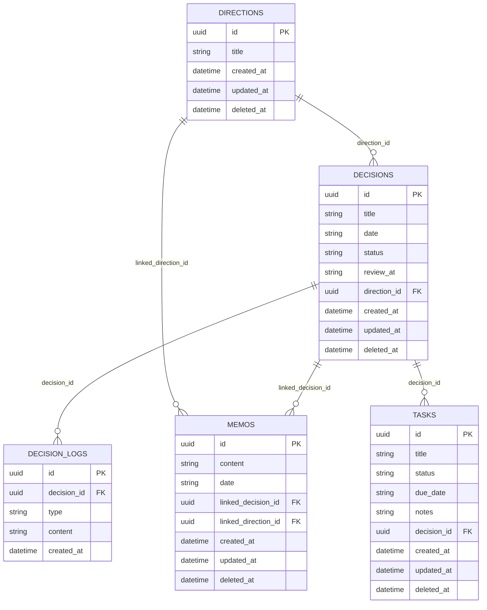

# Domain Entities

This document is the single source of truth for all entity definitions in Deciduum.

---

## Overview

Deciduum uses five core domain entities:

1. **Decision** - A conscious choice made at a specific date
2. **DecisionLog** - Evolving reasoning or updates around a Decision
3. **Memo** - An unstructured cognitive note
4. **Direction** - A long-term contextual grouping
5. **Task** - A sub-task action item linked to a Decision

---

## 1. Decision

Represents a conscious choice made at a specific date.

### TypeScript Definition

```typescript
interface Decision {
  id: UUID;                                    // Unique identifier (UUID v4)
  title: string;                              // Decision title (1-500 characters)
  date: string;                                // Decision date (YYYY-MM-DD format)
  status: DecisionStatus;                      // Decision status
  review_at: string | null;                   // Optional review date (YYYY-MM-DD)
  direction_id: UUID | null;                  // Optional direction association
  created_at: string;                          // Creation timestamp (ISO 8601)
  updated_at: string;                          // Last update timestamp (ISO 8601)
  deleted_at: string | null;                   // Soft delete marker (ISO 8601)
}

type DecisionStatus = 'completed' | 'ongoing' | 'archived';
```

### Database Schema

```sql
CREATE TABLE decisions (
    id TEXT PRIMARY KEY,
    title TEXT NOT NULL,
    date TEXT NOT NULL,
    status TEXT NOT NULL DEFAULT 'ongoing',
    review_at TEXT,
    direction_id TEXT,
    created_at TEXT NOT NULL DEFAULT (datetime('now')),
    updated_at TEXT NOT NULL DEFAULT (datetime('now')),
    deleted_at TEXT,
    CONSTRAINT chk_decisions_title_not_empty CHECK (LENGTH(TRIM(title)) > 0),
    CONSTRAINT chk_decisions_status CHECK (status IN ('completed', 'ongoing', 'archived')),
    CONSTRAINT chk_decisions_date_format CHECK (date LIKE '____-__-__'),
    CONSTRAINT fk_decisions_direction_id FOREIGN KEY (direction_id) REFERENCES directions(id) ON DELETE SET NULL,
    CONSTRAINT chk_review_at_not_before_date CHECK (review_at IS NULL OR review_at >= date)
);
```

### Field Specifications

| Field | Type | Required | Constraints | Default |
|-------|------|----------|-------------|---------|
| `id` | TEXT (UUID) | Yes | Primary Key, non-empty UUID v4 | Generated by app |
| `title` | TEXT | Yes | 1-500 characters, non-empty | - |
| `date` | TEXT | Yes | YYYY-MM-DD format | - |
| `status` | TEXT | Yes | 'completed', 'ongoing', 'archived' | 'ongoing' |
| `review_at` | TEXT | No | YYYY-MM-DD, must be >= date | NULL |
| `direction_id` | TEXT (UUID) | No | FK → directions.id | NULL |
| `created_at` | TEXT | Yes | ISO 8601 datetime | datetime('now') |
| `updated_at` | TEXT | Yes | ISO 8601 datetime | datetime('now') |
| `deleted_at` | TEXT | No | ISO 8601 datetime (soft delete) | NULL |

### Business Rules

1. **Manual Status Only**: The `status` field must be changed manually by the user. No automatic transitions.
2. **Review Date**: If set, `review_at` must be on or after the `date`.
3. **Soft Delete**: Deleting a Decision is a soft delete. Associated DecisionLogs are preserved as immutable history.
4. **Direction Association**: A Decision may optionally belong to one Direction.

### Example

```json
{
  "id": "550e8400-e29b-41d4-a716-446655440000",
  "title": "Define backend structure",
  "date": "2026-02-17",
  "status": "ongoing",
  "review_at": "2026-03-01",
  "direction_id": "550e8400-e29b-41d4-a716-446655440001",
  "created_at": "2026-02-17T10:30:00Z",
  "updated_at": "2026-02-17T10:30:00Z",
  "deleted_at": null
}
```

---

## 2. DecisionLog

Represents the evolving reasoning or updates around a Decision.

### TypeScript Definition

```typescript
interface DecisionLog {
  id: UUID;                                    // Unique identifier (UUID v4)
  decision_id: UUID;                           // Parent Decision
  type: DecisionLogType;                       // Log type
  content: string;                             // Log content (1-10000 characters)
  created_at: string;                          // Creation timestamp (ISO 8601, immutable)
}

type DecisionLogType = 'note' | 'reflection' | 'state_change';
```

### Database Schema

```sql
CREATE TABLE decision_logs (
    id TEXT PRIMARY KEY,
    decision_id TEXT NOT NULL,
    type TEXT NOT NULL,
    content TEXT NOT NULL,
    created_at TEXT NOT NULL DEFAULT (datetime('now')),
    CONSTRAINT chk_decision_logs_type CHECK (type IN ('note', 'reflection', 'state_change')),
    CONSTRAINT chk_content_not_empty CHECK (LENGTH(TRIM(content)) > 0),
    CONSTRAINT fk_decision_logs_decision_id FOREIGN KEY (decision_id) REFERENCES decisions(id) ON DELETE CASCADE
);
```

### Field Specifications

| Field | Type | Required | Constraints | Default |
|-------|------|----------|-------------|---------|
| `id` | TEXT (UUID) | Yes | Primary Key, non-empty UUID v4 | Generated by app |
| `decision_id` | TEXT (UUID) | Yes | FK → decisions.id | - |
| `type` | TEXT | Yes | 'note', 'reflection', 'state_change' | - |
| `content` | TEXT | Yes | 1-10000 characters, non-empty | - |
| `created_at` | TEXT | Yes | ISO 8601 datetime | datetime('now') |

### Business Rules

1. **Append-Only**: DecisionLogs are append-only. They can be created and read, but NOT updated or deleted.
2. **Immutability**: The `created_at` timestamp is immutable once created.
3. **Parent Dependency**: A DecisionLog must belong to an existing Decision.
4. **No Soft Delete**: DecisionLogs do not have a `deleted_at` field. They are preserved as immutable history.

### Log Types

| Type | Description |
|------|-------------|
| `note` | General note or context about the decision |
| `reflection` | Reflection or re-evaluation of the decision |
| `state_change` | Manual status change with context |

### Example

```json
{
  "id": "550e8400-e29b-41d4-a716-446655440010",
  "decision_id": "550e8400-e29b-41d4-a716-446655440000",
  "type": "reflection",
  "content": "Reconfirmed this direction after team review",
  "created_at": "2026-02-18T14:00:00Z"
}
```

---

## 3. Memo

Represents a thought or unstructured cognitive note.

### TypeScript Definition

```typescript
interface Memo {
  id: UUID;                                    // Unique identifier (UUID v4)
  content: string;                             // Memo content (1-10000 characters)
  date: string;                                // Memo date (YYYY-MM-DD format)
  linked_decision_id: UUID | null;            // Optional link to a Decision
  linked_direction_id: UUID | null;            // Optional link to a Direction
  created_at: string;                          // Creation timestamp (ISO 8601)
  updated_at: string;                          // Last update timestamp (ISO 8601)
  deleted_at: string | null;                   // Soft delete marker (ISO 8601)
}
```

### Database Schema

```sql
CREATE TABLE memos (
    id TEXT PRIMARY KEY,
    content TEXT NOT NULL,
    date TEXT NOT NULL,
    linked_decision_id TEXT,
    linked_direction_id TEXT,
    created_at TEXT NOT NULL DEFAULT (datetime('now')),
    updated_at TEXT NOT NULL DEFAULT (datetime('now')),
    deleted_at TEXT,
    CONSTRAINT chk_memo_content_not_empty CHECK (LENGTH(TRIM(content)) > 0),
    CONSTRAINT chk_memos_date_format CHECK (date LIKE '____-__-__'),
    CONSTRAINT fk_memos_linked_decision_id FOREIGN KEY (linked_decision_id) REFERENCES decisions(id) ON DELETE SET NULL,
    CONSTRAINT fk_memos_linked_direction_id FOREIGN KEY (linked_direction_id) REFERENCES directions(id) ON DELETE SET NULL
);
```

### Field Specifications

| Field | Type | Required | Constraints | Default |
|-------|------|----------|-------------|---------|
| `id` | TEXT (UUID) | Yes | Primary Key, non-empty UUID v4 | Generated by app |
| `content` | TEXT | Yes | 1-10000 characters, non-empty | - |
| `date` | TEXT | Yes | YYYY-MM-DD format | - |
| `linked_decision_id` | TEXT (UUID) | No | FK → decisions.id | NULL |
| `linked_direction_id` | TEXT (UUID) | No | FK → directions.id | NULL |
| `created_at` | TEXT | Yes | ISO 8601 datetime | datetime('now') |
| `updated_at` | TEXT | Yes | ISO 8601 datetime | datetime('now') |
| `deleted_at` | TEXT | No | ISO 8601 datetime (soft delete) | NULL |

### Business Rules

1. **Soft Delete**: Deleting a Memo is a soft delete.
2. **Optional Linking**: A Memo may optionally link to one Decision and/or one Direction.
3. **Content**: Memos are unstructured - they are free-form thoughts without predefined fields.

### Example

```json
{
  "id": "550e8400-e29b-41d4-a716-446655440020",
  "content": "Thinking about the API structure...",
  "date": "2026-02-17",
  "linked_decision_id": null,
  "linked_direction_id": "550e8400-e29b-41d4-a716-446655440001",
  "created_at": "2026-02-17T11:00:00Z",
  "updated_at": "2026-02-17T11:00:00Z",
  "deleted_at": null
}
```

---

## 4. Direction

Represents a long-term contextual grouping of Decisions.

### TypeScript Definition

```typescript
interface Direction {
  id: UUID;                                    // Unique identifier (UUID v4)
  title: string;                               // Direction title (1-200 characters, unique)
  created_at: string;                          // Creation timestamp (ISO 8601)
  updated_at: string;                          // Last update timestamp (ISO 8601)
  deleted_at: string | null;                   // Soft delete marker (ISO 8601)
}
```

### Database Schema

```sql
CREATE TABLE directions (
    id TEXT PRIMARY KEY,
    title TEXT NOT NULL,
    created_at TEXT NOT NULL DEFAULT (datetime('now')),
    updated_at TEXT NOT NULL DEFAULT (datetime('now')),
    deleted_at TEXT,
    CONSTRAINT chk_directions_title_not_empty CHECK (LENGTH(TRIM(title)) > 0),
    CONSTRAINT uq_directions_title UNIQUE (title)
);
```

### Field Specifications

| Field | Type | Required | Constraints | Default |
|-------|------|----------|-------------|---------|
| `id` | TEXT (UUID) | Yes | Primary Key, non-empty UUID v4 | Generated by app |
| `title` | TEXT | Yes | 1-200 characters, non-empty, unique | - |
| `created_at` | TEXT | Yes | ISO 8601 datetime | datetime('now') |
| `updated_at` | TEXT | Yes | ISO 8601 datetime | datetime('now') |
| `deleted_at` | TEXT | No | ISO 8601 datetime (soft delete) | NULL |

### Business Rules

1. **Unique Title**: Each Direction must have a unique title. Duplicate titles return `409 DUPLICATE_RESOURCE`.
2. **Soft Delete**: Deleting a Direction does NOT cascade to associated Decisions or Memos. Instead, `direction_id` and `linked_direction_id` are set to NULL.
3. **No Calendar Default**: Directions do not appear on Calendar view by default.
4. **Manual Assignment**: Directions are manually assigned by users.

### Example

```json
{
  "id": "550e8400-e29b-41d4-a716-446655440001",
  "title": "Career Development",
  "created_at": "2026-01-15T09:00:00Z",
  "updated_at": "2026-01-15T09:00:00Z",
  "deleted_at": null
}
```

---

## 5. Task

Represents a sub-task action item linked to a Decision.

### TypeScript Definition

```typescript
interface Task {
  id: UUID;                                    // Unique identifier (UUID v4)
  title: string;                              // Task title (1-500 characters)
  status: TaskStatus;                         // Task status
  due_date: string | null;                   // Optional due date (YYYY-MM-DD)
  notes: string | null;                      // Optional notes (Text)
  decision_id: UUID;                          // Parent Decision
  created_at: string;                          // Creation timestamp (ISO 8601)
  updated_at: string;                          // Last update timestamp (ISO 8601)
  deleted_at: string | null;                   // Soft delete marker (ISO 8601)
}

type TaskStatus = 'pending' | 'in_progress' | 'completed';
```

### Database Schema

```sql
CREATE TABLE tasks (
    id TEXT PRIMARY KEY,
    title TEXT NOT NULL,
    status TEXT NOT NULL DEFAULT 'pending',
    due_date TEXT,
    notes TEXT,
    decision_id TEXT NOT NULL,
    created_at TEXT NOT NULL DEFAULT (datetime('now')),
    updated_at TEXT NOT NULL DEFAULT (datetime('now')),
    deleted_at TEXT,
    CONSTRAINT chk_tasks_title_not_empty CHECK (LENGTH(TRIM(title)) > 0),
    CONSTRAINT chk_tasks_status CHECK (status IN ('pending', 'in_progress', 'completed')),
    CONSTRAINT chk_tasks_date_format CHECK (due_date IS NULL OR due_date LIKE '____-__-__'),
    CONSTRAINT fk_tasks_decision_id FOREIGN KEY (decision_id) REFERENCES decisions(id) ON DELETE CASCADE
);
```

### Field Specifications

| Field | Type | Required | Constraints | Default |
|-------|------|----------|-------------|---------|
| `id` | TEXT (UUID) | Yes | Primary Key, non-empty UUID v4 | Generated by app |
| `title` | TEXT | Yes | 1-500 characters, non-empty | - |
| `status` | TEXT | Yes | 'pending', 'in_progress', 'completed' | 'pending' |
| `due_date` | TEXT | No | YYYY-MM-DD format | NULL |
| `notes` | TEXT | No | Text content | NULL |
| `decision_id` | TEXT (UUID) | Yes | FK → decisions.id | - |
| `created_at` | TEXT | Yes | ISO 8601 datetime | datetime('now') |
| `updated_at` | TEXT | Yes | ISO 8601 datetime | datetime('now') |
| `deleted_at` | TEXT | No | ISO 8601 datetime (soft delete) | NULL |

### Business Rules

1. **Soft Delete**: Deleting a Task is a soft delete. The task is hidden but preserved in the database.
2. **Parent Dependency**: A Task must belong to an existing Decision. When a Decision is deleted, all associated Tasks are also soft deleted.
3. **Status Transitions**: Tasks can transition between any statuses manually.

### Example

```json
{
  "id": "550e8400-e29b-41d4-a716-446655440030",
  "title": "Set up database schema",
  "status": "in_progress",
  "due_date": "2026-02-20",
  "notes": "Use SQLAlchemy with async support",
  "decision_id": "550e8400-e29b-41d4-a716-446655440000",
  "created_at": "2026-02-17T10:30:00Z",
  "updated_at": "2026-02-17T10:30:00Z",
  "deleted_at": null
}
```

---

## Entity Relationships



### Relationship Summary

| Parent | Child | Cascade Behavior |
|--------|-------|-----------------|
| directions | decisions | SET NULL on soft delete |
| directions | memos | SET NULL on soft delete |
| decisions | decision_logs | CASCADE on hard delete only |
| decisions | memos | SET NULL on soft delete |
| decisions | tasks | CASCADE on soft delete |

---

## Common Fields

All domain entities except DecisionLog share common fields:

| Field | Description |
|-------|-------------|
| `id` | UUID v4, generated at application layer |
| `created_at` | ISO 8601 datetime, set on creation |
| `updated_at` | ISO 8601 datetime, updated on every modification |
| `deleted_at` | ISO 8601 datetime, set on soft delete (NULL = active) |

---

## Soft Delete Pattern

Domain entities (`directions`, `decisions`, `memos`) implement soft deletes:

```sql
-- Active records
WHERE deleted_at IS NULL

-- Soft delete operation
UPDATE decisions SET deleted_at = datetime('now') WHERE id = '...'

-- Restore operation
UPDATE decisions SET deleted_at = NULL WHERE id = '...'
```

---

## Version

- **Version:** 1.1.0
- **Last Updated:** 2026-02-18
- **Related:** [status.md](./status.md), [api/endpoints.md](../api/endpoints.md), [implementation/schema.md](../implementation/schema.md), [implementation/tasks.md](../implementation/tasks.md)
